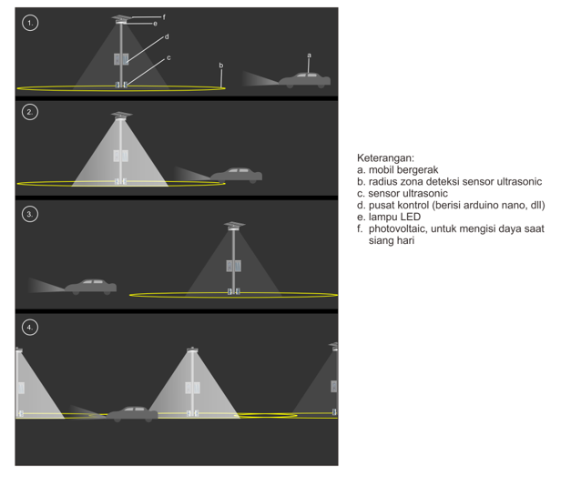
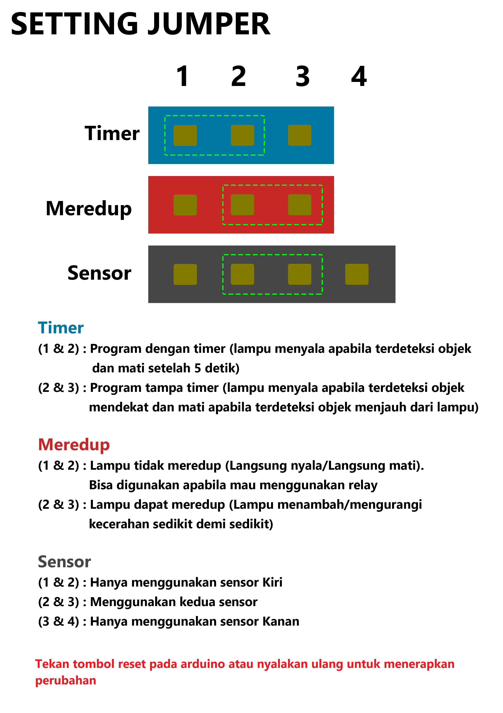
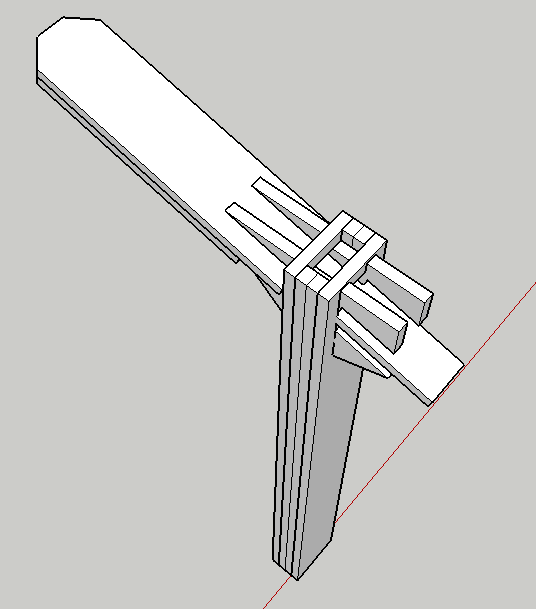
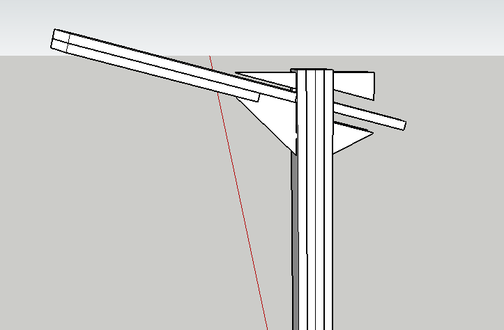
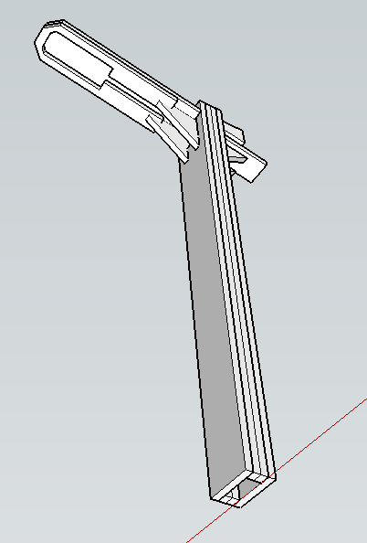
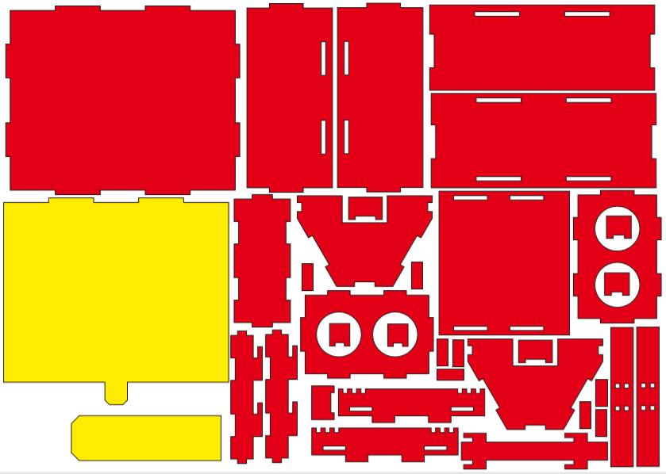

# Smart Street Lights

Alat ini diciptakan untuk memberikan kontribusi dan solusi pada pemerintah terkait permasalahan konsumsi listrik pada PJU yang relatif besar, apabila alat ini diterapkan, tentu akan menghemat konsumsi listrik yang dihabiskan oleh PJU. Dengan mengurangi konsumsi llistrik, secara tidak langsung juga mengurangi pembuangan gas emisi yang dihasilkan dari bahan fosil yang mana merupakan bahan bakar yang paling banyak digunakan sebagai pembangkit listrik PLN. Selain itu, penggunaan photovoltaik yang ramah lingkungan mendukung energi terbarukan yang selama ini digencarkan. 

## Komponen
 - Acrylic
 - Solar Panel 5v
 - Arduino
 - Sensor Ultrasonic
 - Mosfet IRF3205
 - LED 
 - Modul Stepup ke 5v
 - Modul Charger
 - Batterai 18650
 - Saklar
 - Kabel

## Sistem Kerja Alat

1.	Keadaan lampu akan menyala redup ketika tidak ada objek datang di zona deteksi sensor ultrasonic
2.	Ketika mobil masuk dalam zona deteksi, lampu LED otomatis menyala terang, didukung dengan 2 buah  sensor ultrasonic untuk mendeteksi dua arah berlawanan zona deteksi dapat diatur jaraknya sesuai kebutuhan.
3.	Ketika mobil lepas dari zona deteksi lampu kembali menyala redup
4.	Pada penerapannya, zona deteksi diatur jaraknya sedemikian rupa agar tidak membahayakan pengendara yang melaju cepat (lampu harus menyala terang beberapa detik sebelum kendaraan lewat sehingga tidak mengganggu penglihatan pengendara)

## Konfigurasi Alat
**Posisi Jumper**
 

**Konfigurasi Jumper**
 

## Foto Alat

## Box Acrylic
Box Acrylic didesain dalam bentuk 3D ([Uncomplete 3D Design.skp](https://github.com/nazililham11/smart_street_lights-arduino/blob/a32a4c9f92976d29509b6a7dd917555c43372e27/Assets/Uncomplete%203D%20Design.skp)) untuk menentukan desain, sistem penguncian (untuk bongkar/pasang acrylic), tata letak, dan posisi dari hardware.

 Setelah desain 3D telah dibuat kemudian dibuat versi cutting acrylic ([acrylic.cdr](https://github.com/nazililham11/measurement_tool/raw/master/Assets/acrylic.cdr)) menggunakan aplikasi corel draw. Acrylic yang digunakan yaitu acrylic dengan tebal 2mm berwarna bening dan hitam.
 
Kuning pada desain menunjukan acrylic bening dan merah menunjukan acrylic hitam.
